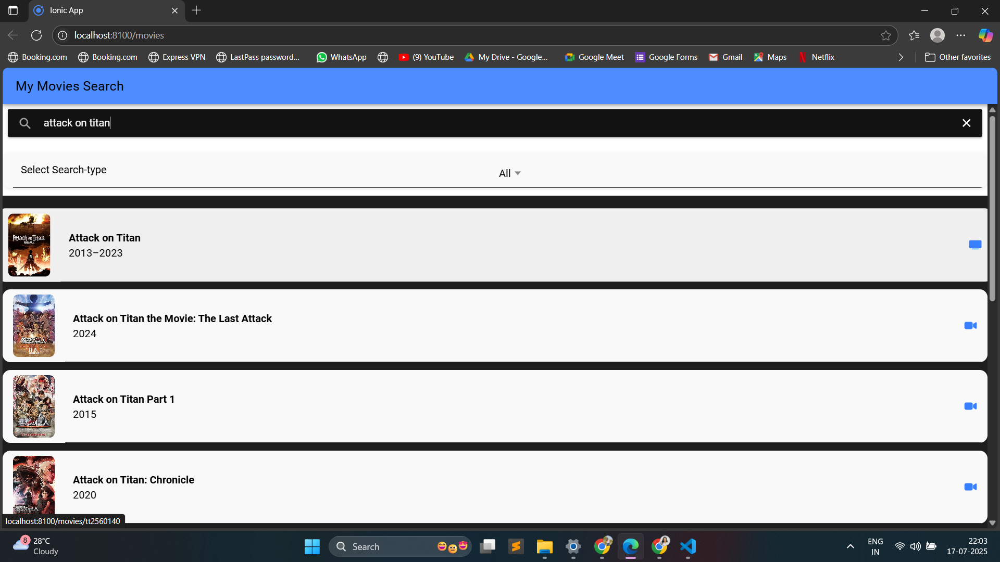
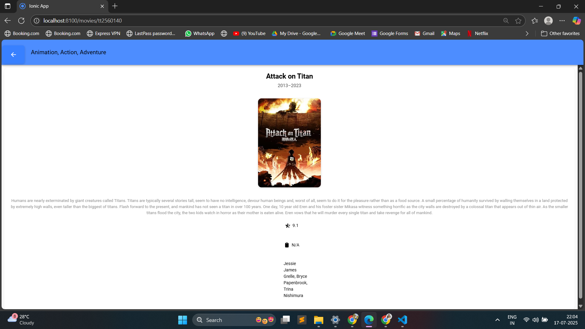

# 🎬 Movie Search App (Ionic + OMDb API)

A sleek, mobile-friendly app built with **Ionic Framework** and **Angular**, allowing users to search for movies, series, and episodes using the **OMDb API**. Users can view search results, filter by type, and explore detailed information about each title — including posters, plot summaries, ratings, directors, and actors.

---

## 🌟 Features

- 🔍 **Search** movies, series, or episodes by title  
- 🎚️ **Filter by type**: movie, series, episode, or all  
- 📜 **View details** including poster, plot, IMDB rating, director, and cast  
- 🧭 **Smooth navigation** between list and detail pages  
- 🎨 **Clean UI** styled using SCSS and Ionic components  
- 🔗 **External link** to movie websites (when available)  

---

## 🚀 Tech Stack

- **Ionic Framework**
- **Angular**
- **TypeScript**
- **SCSS**
- **OMDb API**

---

## 📸 Screenshots

Search Page



----------------------------------------------------
Movie Details




---

## 🔧 Getting Started

### 1. Clone the repository:
```bash
git clone https://github.com/your-username/movie-search-ionic.git
cd movie-search-ionic
